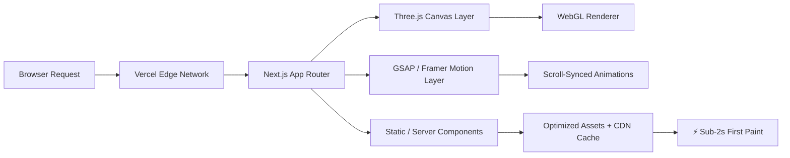

<div align="center">


<a href="https://divyang-u-portfolio.vercel.app/">
  
</a>

<br/>

[](https://divyang-u-portfolio.vercel.app/)
[](https://github.com/DivyangUGitHub/DivyangU-Portfolio)
[](https://divyang-u-portfolio.vercel.app/)

</div>

<br/>

## 🌌 Overview

A **responsive, performance-optimized personal portfolio** built to feel less like a static webpage and more like an experience — real-time **3D visuals**, scroll-driven **motion design**, and buttery-smooth transitions, all shipped at sub-2-second load times.

<br/>

## ✨ Features

<table>
<tr>
<td width="50%">

**🎮 Immersive 3D Visuals**
Interactive Three.js scenes rendered directly in the browser — lightweight, GPU-friendly, and fully responsive.

**🎬 Scroll-Driven Motion**
GSAP ScrollTrigger + Framer Motion power cinematic, physics-based scroll animations across every section.

</td>
<td width="50%">

**⚡ Blazing Performance**
95+ Lighthouse score across all device types, with sub-2s load times via Vercel Edge deployment.

**📱 Fully Responsive**
Pixel-perfect across mobile, tablet, and desktop — no breakpoints left behind.

</td>
</tr>
</table>

<br/>

## 🛠️ Tech Stack

<div align="center">

</div>

<br/>

| Layer | Technology |
|---|---|
| **Framework** | Next.js (App Router) |
| **Language** | TypeScript |
| **3D / WebGL** | Three.js |
| **Animation** | GSAP, Framer Motion |
| **Styling** | Tailwind CSS |
| **Deployment** | Vercel (Edge Network) |

<br/>

## 🏗️ Architecture



<br/>

## 📊 Performance

<div align="center">

| Metric | Score |
|---|---|
| 🟢 Performance | 95+ |
| 🟢 Accessibility | 95+ |
| 🟢 Best Practices | 95+ |
| 🟢 SEO | 95+ |
| ⏱️ Load Time | < 2s |

</div>

<br/>

## 🚀 Getting Started

```bash
# Clone the repository
git clone https://github.com/DivyangUGitHub/DivyangU-Portfolio.git
cd DivyangU-Portfolio

# Install dependencies
npm install

# Run the dev server
npm run dev
```

Open [http://localhost:3000](http://localhost:3000) to view it locally.

<br/>

## 📁 Project Structure

```
DivyangU-Portfolio/
├── app/                # Next.js App Router pages
├── components/         # Reusable UI + 3D components
├── public/              # Static assets
├── styles/              # Tailwind config & globals
└── lib/                 # Utilities & animation helpers
```

<br/>

## 📬 Contact

<div align="center">

[](https://divyang-u-portfolio.vercel.app/)
[](https://www.linkedin.com/in/divyang-upreti/)
[](mailto:upretidivyang@gmail.com)

</div>


