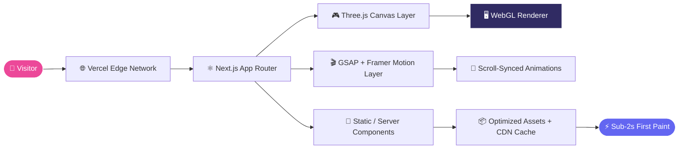
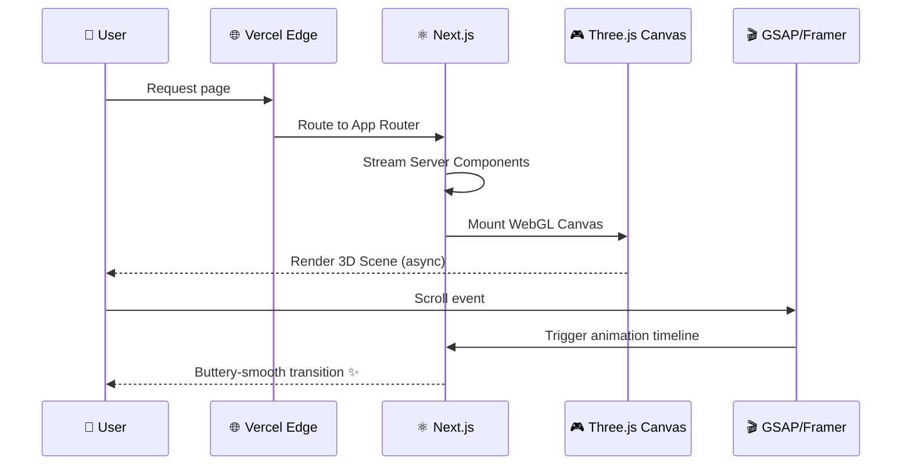

<div align="center">


<br/><br/>

<a href="https://divyang-u-portfolio.vercel.app/"></a>
<a href="https://github.com/DivyangUGitHub/DivyangU-Portfolio"></a>
<a href="https://divyang-u-portfolio.vercel.app/"></a>


<br/>


</div>


## 🎯 About This Project

> A **responsive, performance-obsessed personal portfolio** engineered to feel less like a static webpage and more like an *experience*. Real-time WebGL scenes, physics-driven scroll animations, and cinematic transitions — shipped at **sub-2-second load times**.


## ✨ Feature Highlights

<table width="100%">
<tr>
<td width="50%" valign="top">

### 🎮 Immersive 3D Visuals
Interactive **Three.js** WebGL scenes rendered natively in the browser — lightweight, GPU-friendly, buttery on mobile *and* desktop.

### 🎬 Scroll-Driven Motion
**GSAP ScrollTrigger** + **Framer Motion** power cinematic, physics-based animation sequences across every section.

</td>
<td width="50%" valign="top">

### ⚡ Blazing Performance
**95+ Lighthouse** score across all four categories, with sub-2s first paint via Vercel's Edge Network.

### 📱 Pixel-Perfect Responsive
Fluid layouts tuned for mobile, tablet, and desktop — zero broken breakpoints, zero compromises.

</td>
</tr>
</table>


## 🧰 Complete Tech Arsenal

<div align="center">

</div>

<br/>

<div align="center">

**Core Framework**
<br/>


**3D · Animation · Motion**
<br/>


**Styling · Deployment · Tooling**
<br/>


</div>


## 🏗️ Architecture



### 🔄 Render Lifecycle




## 📊 Performance Metrics

<div align="center">


</div>


## 🚀 Quick Start

```bash
# 1. Clone the repository
git clone https://github.com/DivyangUGitHub/DivyangU-Portfolio.git
cd DivyangU-Portfolio

# 2. Install dependencies
npm install

# 3. Run the dev server
npm run dev
```

Open **[localhost:3000](http://localhost:3000)** to view it locally. 🎉

<details>
<summary>📦 <b>Build for production</b></summary>

```bash
npm run build
npm run start
```
</details>


## 📁 Project Structure

```
DivyangU-Portfolio/
├── app/                 # Next.js App Router pages
├── components/          # Reusable UI + 3D scene components
│   ├── three/            # Three.js scene / mesh components
│   └── ui/                # Shared UI primitives
├── public/               # Static assets, textures, models
├── styles/               # Tailwind config & globals
└── lib/                  # Animation helpers & utilities
```

## 🗺️ Roadmap

- [x] Core 3D scene + scroll animation system
- [x] 95+ Lighthouse optimization pass
- [ ] Add WebGL particle background
- [ ] Dark / Light theme toggle
- [ ] Blog section with MDX


## 📬 Connect

<div align="center">

[](https://divyang-u-portfolio.vercel.app/)
[](https://www.linkedin.com/in/divyang-upreti/)
[](https://github.com/DivyangUGitHub)
[](mailto:upretidivyang@gmail.com)

### ⭐ If this caught your eye, drop a star — it means a lot!

</div>


